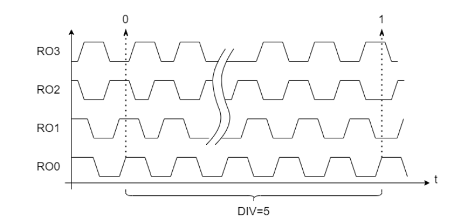

# Implementing a True Random Number Generator on an FPGA

## Table of Contents

1. [Introduction](#introduction)
   - [Project Goals](#project-goals)
   - [Background](#background)

2. [System Architecture](#system-architecture)
   - [VHDL Structure](#vhdl-structure)
   - [Ring Oscillators and MUROs](#ring-oscillators-and-muros)

3. [Randomness Testing](#randomness-testing)
   - [Test Suite Overview](#test-suite-overview)
   - [Results Summary](#results-summary)

4. [Takeaways](#takeaways)
   - [Entropy is Fragile](#entropy-is-fragile)
   - [You Can Be Broke and Have a TRNG](#you-can-be-broke-and-have-a-trng)
   - [Future Ideas](#future-ideas)
   
6. [References](#references)

## Introduction

### Project Goals

- Software PRNGs are cool, but **analog noise is cooler.** With this project, a **true random number generator (TRNG)** was implemented on an SoC FPGA. The randomness quality was evaluated using **NIST SP 800-22** and **NIST SP 800-90B** standards.

### Background

- A **System on Chip (SoC) Field-Programmable Gate Array (FPGA)** is an integrated circuit (IC) that combines a **Hard Processing System,** a dedicated CPU, with **FPGA Fabric,** which can be reconfigured at the hardware level after manufacturing.
- **True Random Number Generators** (TRNGs) derive randomness from physical processes (entropy), while PRNGs are deterministic and use mathematical algorithms. TRNGs are essential in cryptography because predictable numbers can compromise security.
- This system's primary entropy source is **ring oscillators**, which exploit **thermal noise and jitter in electronics** for unpredictable bit generation.
- These generated bits often contain **bias or correlation**, so post-processing ensures uniform randomness. The following conditioning was implemented:
   - **Von-Neumann correction** removes bias by discarding consecutive identical bits.
   - **LFSR-based whitening** spreads entropy across the output bits by using linear feedback, reducing correlations.

> A famous TRNG is **[Cloudflare's Lavarand](https://en.wikipedia.org/wiki/Lavarand)**, which sources entropy from pixel imaging of a wall of lava lamps! Fun fact- It uses SHA-1 Hashing for post-processing, which prevents reversibility of the entropy patterns (since hashing is computationally infeasible to reverse).

## System Architecture

### VHDL Structure

- `trng_avalon.vhd` - HPS-to-Fabric interface to expose 32-bit read only register.
- `trng.vhd` - Is the core logic. It generates the TRNG bitstream by:
    1. Collects outputs from four MUROs.
    2. Applies Von-Neumann correction to reduce bias.
    3. Puts the bit into a 32-bit Linear Feedback Shift Register (LFSR) with the seed polynomial `x^32 + x^22 + x^17 + x^16 + 1` to spread entropy and reduce correlations.
- `muro.vhd` - Multi-Ring Oscillator (MURO) module structure.
  - `ring_oscillator_async.vhd` - Provides asynchronous clock signals derived from individual ring oscillators.
  - `ring_oscillator.vhd` - Generates jittered oscillations to be sampled with D flip-flops triggered by the oscillator-derived clock.

This hierarchical design separates concerns: `muro.vhd` handles entropy collection, `trng.vhd` manages bit conditioning, and `trng_avalon.vhd` interfaces with the CPU.

### Ring Oscillators and MUROs

- **Seven Ring Oscillators**, each with seven inverters, were XORed together to serve as the primary entropy source.
- A **MURO** samples seven oscillators with a divided oscillator-derived clock. 
- **Theory of Operation:** Ring oscillators are ideally perfect "clocks." But, due to physical variations and analog noise, each ring oscillator has a slight timing jitter. When multiple ring oscillators are simultaneously-sampled after a few clock cycles, they will be slightly offset due to accumulated jitter.

- **Design Considerations:** RO proximity induces correlations, beacuse nearby ROs experience similar noise. Quartus Lite was used as the compiler, and does not allow floorplanning, so the following choices were made to optimize entropy:
   - A larger clock divider slows the throughput, but allows jitter to accumulate more fully.
   - An increased amount of inverters per RO increases RO frequency to compensate for the slower throughput caused by the divider.
   - Multiple MUROs had a higher chance of being spread across FPGA and increase the likelihood of varying noise conditions and reduce correlations between ROs.

## Randomness Testing

### Test Suite Overview

- [Full Testing Procedure](../sw/testing)

- The TRNG output was temporarily routed onto one of the FPGA's GPIO pins during development. From there a **Labjack T7-Pro** was used to sample the GPIO pin and saved into a file for randomness testing. This method increased development time, as the full SoC system did not need to be compiled, instead just the fabric was and directly interfaced with. A sampling rate was used 3.3kHz, and 70M bits were collected over the span of 6 hours, provdiding a statitically significant dataset for verification that occurred over thermal drift in regular operation.

- **NIST SP 800-22** statistical test suite (V2.1.2) was the primary test for validation. It validates several aspects of randomness, including: the frequency of `1` and `0` bits are equal and checks for correlation, repeatability, and the level of unpredictability. 

- Additonally, the **NIST SP 800-90B** statistical test suite was used to verify the entropy source and conditioning quality not from the overall bistream but from the source itself. So, it's pretty much the SP 800-22, but with different math.

> Essentially, the NIST's Statistical Test Suites will break your heart if it's not statistically random according to federal standards.

### Results Summary

#### NIST SP 800-22 Summary:

The FPGA True Random Number Generator is statistically random according to NIST SP 800-22 Criteria.

| **Test**  | **P-Value** | **Score** | **Pass/Fail?** |
| :--- | :---: | :---: | ---: |
| Frequency | 0.017912 | 98/100 | Pass |
| Block Frequency | 0.851383 | 99/100 | Pass |
| Cumulative Sums (ave) | 0.547965 | 97.5/100 | Pass |
| Runs | 0.834308 | 100/100 | Pass |
| Longest Run | 0.883171 | 100/100 | Pass |
| Rank | 0.236810 | 97/100 | Pass |
| FFT | 0.40119 | 99/100 | Pass |
| Non Overlapping Template (ave) | 0.494875 | 99/100 | Pass |
| Overlapping Template (ave) | 0.851383 | 99/100 | Pass |
| Universal | 0.441199 | 99/100 | Pass |
| Approximate Entropy | 0.678686 | 98/100 | Pass |
| Random Excursions (ave) | 0.239909 | 38.5/39 | Pass |
| Random Excursions Variant (ave) | 0.204264 | 38.7/39 | Pass |
| Serial (ave) | 0.368002 | 99/100 | Pass |
| Linear Complexity | 0.834308 | 100/100 | Pass |

> Note: A score of 96/100 is required to pass the given test (36 for random excursions).

#### NIST SP 800-90B Summary:

The FPGA True Random Number Generator provides a near-ideal entropy source according to the NIST SP 800-90B Criteria.

- Min-Entropy Estimate:
   - **h':** 0.998100 *(Best Score 1)*

- Bias Estimates:
   - **Mean:** 127.632 *(Best Score 128)*
   - **Mode:** 128 *(Best Score 128)*
   - **P-Hat:** 0.50048968528854731 *(Best Score 0.5)*

- Chi-Square, Longest Repeated Substring, and Permutation Tests Passed.

## Takeaways

This project was extremely insightful in refining VHDL scripting and debugging techniques, along with understanding digital circuitry and clock synchronization within FPGA fabric. But, those skills can be refined anywhere. This project specifically taught me these things:

### Entropy is Fragile

By actively conducting and failing NIST tests during the TRNG development, an effective understanding of entropy sources and statistical randomness was developed. From too-slow clock dividers to insufficient conditioning, understanding how changes within the FPGA system totally altered the statistical results showed how **fragile the concept of randomness is when applied incorrectly**. 

Primarily, conditioning vastly improved the level of randomness within this system by reducing correlation and spreading out entropy, but **conditioning meant nothing on bad entropy sources.**

### You Can Be Broke and Have a TRNG

An unexpected takeaway from this project was due to hardware limitation. It was determined that **statistically strong TRNGs are still possible to develop when only low-cost equipment is available.** Despite being stuck sampling my TRNG at a breakneck speed of 3.3kHz overnight, I was able test an environment of natural thermal drift that the TRNG should be expected to experience if it were to be used in real-world applications.

And, most significantly, by using Quartus Lite, I found out **ring-oscillator based TRNGs can work without floorplanning**. Statistically strong entropy was still produced without ideal placement of entropy sources, as long as the correct countermeasures are implemented. By adding spacial diveristy with more MUROs and increasing jitter accumulation with a slower divider, statistical randomness was achieved despite this limitation. Take that, well-funded hardware security labs.

### Future Ideas

Lastly, this system provides a great sandbox for potential exploits, because why build something "secure" without trying to make it insecure? Intentionally this time- hopefully Quartus Lite is done optimizing out my "combinational loops"... Further ideas can be found in [this expansion ideas list](expansion_ideas.md), and this repo will be updated if I do actually get around to doing those!

## References

- Kubíček, Jiří. "Data Whitening Used in RF." Kubicek Blog, 2024.
- Le, Jin, et al. "An efficient and stable composed entropy extraction method for FPGA-based RO PUF." IEICE Electronics Express, 2020.
- NIST 800-22 Statistical Test Suite.
- OpenTRNG.com
- Sklavos, Nicolas, et al. *Hardware Security and Trust.* Springer, 2017.
- Torii, Naoya, et al. "Implementation and Evaluation of Ring Oscillator-based True Random Number Generator." SOKA University, 2022.
- Varchola, Michal and Milos Drutarovsky. "New High Entropy Element for FPGA Based True Random Number Generators." Technical University of Kosice, 2010.
