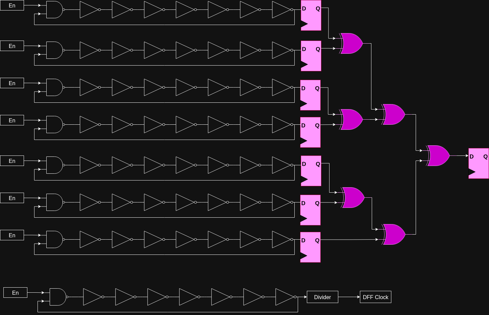

# True Random Number Generator

## Overview

This is a HPS-to-FPGA system for a **True Random Number Generator (TRNG).**

## System

- [VHDL Files](../hdl/trng/)

1. XOR Chains of 8 **Ring Oscillators** are the primary source of entropy. 
2. **MUlti Ring-Oscillator (MUROs)** were built, where multiple ring oscilators are sampled after a divided count of ring oscillator.
3. The output of the MUROs was XORed together.
4. **Von-Neumann Correction** discards biased bits.
5. **Linear Feedback Shift Register (LFSR)** provides whitening where the ring oscillator bits are the provided "seed" and the LFSR generates a new value in its register via XOR masking with a 32-bit polynomial: `x^32 + x^22 + x^17 + x^16 + 1`

**trng.vhd Structure**

**muro.vhd Structure**

## Randomness Results

- [Full Testing](testing/README.md)

- Summary: The FPGA True Random Number Generator is statistically random according to NIST SP 800-22 V2.1.2 Criteria.

| **Test**  | **P-Value** | **Score** | **Pass/Fail?** |
| :--- | :---: | :---: | ---: |
| Frequency | 0.017912 | 98/100 | Pass! |
| Block Frequency | 0.851383 | 99/100 | Pass! |
| Cumulative Sums (ave) | 0.547965 | 97.5/100 | Pass! |
| Runs | 0.834308 | 100/100 | Pass! |
| Longest Run | 0.883171 | 100/100 | Pass! |
| Rank | 0.236810 | 97/100 | Pass! |
| FFT | 0.40119 | 99/100 | Pass! |
| Non Overlapping Template (ave) | 0.494875 | 99/100 | Pass! |
| Overlapping Template (ave) | 0.851383 | 99/100 | Pass! |
| Universal | 0.441199 | 99/100 | Pass! |
| Approximate Entropy | 0.678686 | 98/100 | Pass! |
| Random Excursions (ave) | 0.239909 | 38.5/39 | Pass! |
| Random Excursions Variant (ave) | 0.204264 | 38.7/39 | Pass! |
| Serial (ave) | 0.368002 | 99/100 | Pass! |
| Linear Complexity | 0.834308 | 100/100 | Pass! |

> Note: A score of 96/100 is required to pass the given test (36 for random excursions).

## Resources

- Kubíček, Jiří. "Data Whitening Used in RF." Kubicek Blog, 2024.
- Le, Jin, et al. "An efficient and stable composed entropy extraction method for FPGA-based RO PUF." IEICE Electronics Express, 2020.
- NIST 800-22 Statistical Test Suite.
- OpenTRNG.com
- Sklavos, Nicolas, et al. *Hardware Security and Trust.* Springer, 2017.
- Torii, Naoya, et al. "Implementation and Evaluation of Ring Oscillator-based True Random Number Generator." SOKA University, 2022.
- Varchola, Michal and Milos Drutarovsky. "New High Entropy Element for FPGA Based True Random Number Generators." Technical University of Kosice, 2010.