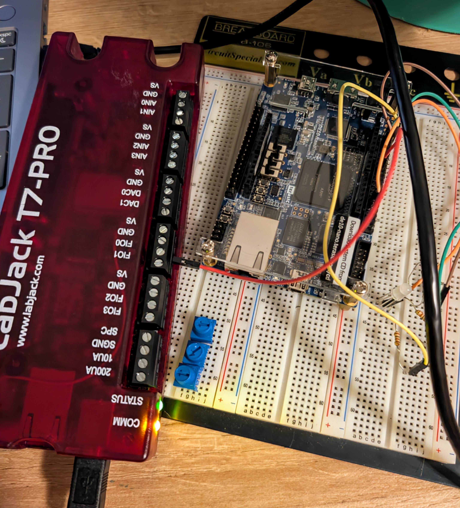

# Testing Procedure

## Overview

The TRNG output is temporarily routed to a GPIO pin, and a LabJack T7-Pro is is used to sample that pin and collect 50M bits of data. The .data file full of the generated TRNGs is put through the NIST 800-22 STS to determine randomness levels.

## Usage

1. Connect a LabJack T7-Pro to your machine via USB.
2. Wire FIO0 to GPIO_0(12) on the DE-10 Nano.
3. Ensure the DE-10 Nano is programmed with the TRNG.
3. In a python environment, run `python lj_data.py`.
4. Once ready (~2 hrs), a file `trng_data.bin` will be generated with 50M bits of data.
6. Use the NIST 800-22 STS to verify randomness.

## Pinouts

| **Pin Name**  | **Note**
| :--- | ---: |
| FIO0 | LabJack Pin |
| GPIO_0(12) | FPGA Pin |

## Test Results

### Test 1 & 2

- NIST Test using the python function showed mostly faliures, while the official NIST Test compared multiple bitstreams and verified even more faliures. Significant faliures such as these point to Quartus optimizing out some of the TRNG architecture and/or timing issues.

- [Test 1](outputs/nist_results_v1_b1.txt)
- [Test 2](outputs/nist_results_v2_b1.txt)

### Test 3

- It was verified that Quartus was not optimizing any necessary information, and , and significant improvements were observed. But, there was still evidence of a significant bias to the `1` bit.

- [Test 3](outputs/nist_results_v3_b1.txt)

### Test 4

- Based on experimentation, it was observed that the metastable GPIO pin was extremely biased. So, it was removed. This improved architecture, on a low dataset, showed much better statistical randomness testing performance.

- [Test 4](outputs/nist_results_4_b1.txt)

### Test 4

- Using the improved architecture, additional MUROs were added to increase the collected entropy and throttling issues were fixed. 50M bits were tested to generate the final result metrics.

- [Final Test](outputs/nist_results_v5_b1.txt)